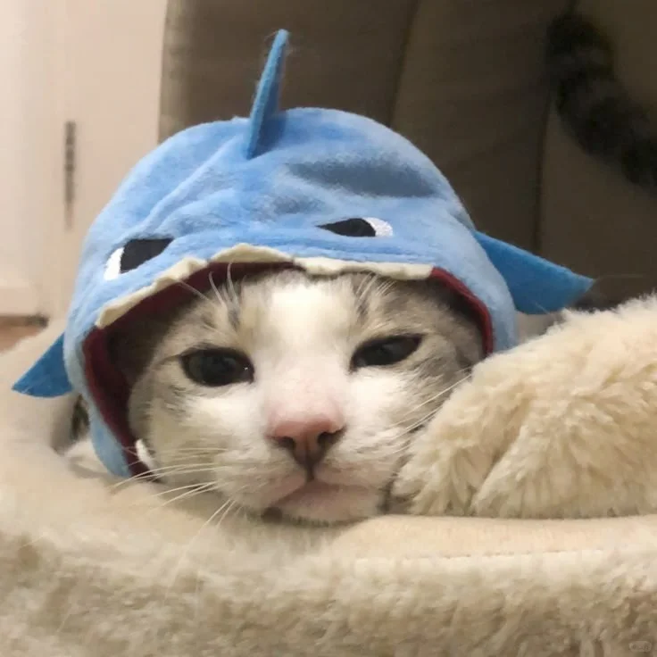

  

# Jingyue Xu

I am a 2025-entry undergraduate student majoring in Software Engineering at [Harbin Institute of Technology (HIT)](https://www.hit.edu.cn/).

Since **2026.4–present**, I have been a **Research Intern** at the **Cross-Media Intelligence Research Center, Harbin Institute of Technology**. My current interests include remote sensing image synthesis, computer vision, 3D object detection, and tracking.

I am inspired by **He Kaiming** and his work on practical, elegant, and scalable computer vision systems.

> *“If you think you have a good idea, either someone else has already done it, or it’s a bad idea.”*  
> — Kaiming He

## Selected projects

- [**FPBA-Syn**](https://github.com/asdf12221/FPBA-Syn) — A general-purpose framework for remote sensing image synthesis and data augmentation.
- [**Remote Object Detection**](https://github.com/asdf12221/remote-dectection-mode-XH-202625) — InternImage + BiFPN + Cascade R-CNN for remote sensing object detection.
- [**HRT Unmanned System Homework**](https://github.com/asdf12221/HRT-unmanned-system-homework) — Entry assignments covering planning, perception, mapping, and control.
- [**Stock Trading Model**](https://github.com/asdf12221/stock-trading-model) — A freshman-year project combining wavelet denoising, Transformer, and XGBoost.

## Skills

  
  
  
  
  
  
  
  

## Contact

If you are interested in research collaboration or open-source projects, feel free to reach out.

- GitHub: [@asdf12221](https://github.com/asdf12221)
- Email: [2025212631@stu.hit.edu.cn](mailto:2025212631@stu.hit.edu.cn)

---

<i>Open to research collaboration and meaningful open-source contributions.</i>

